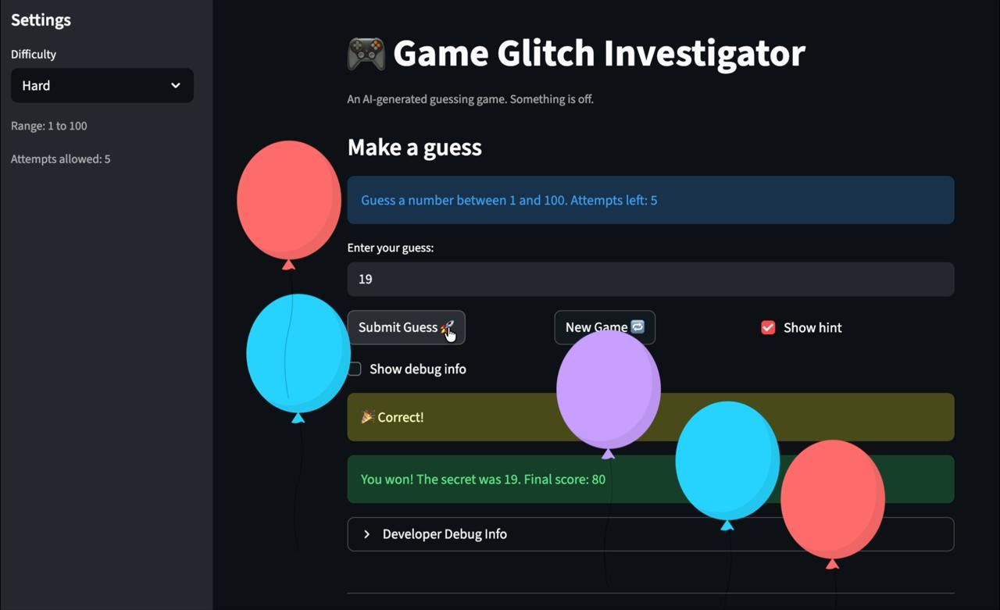
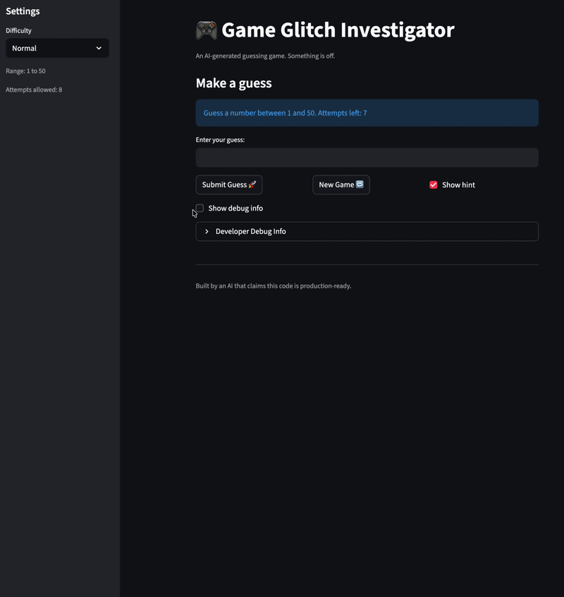
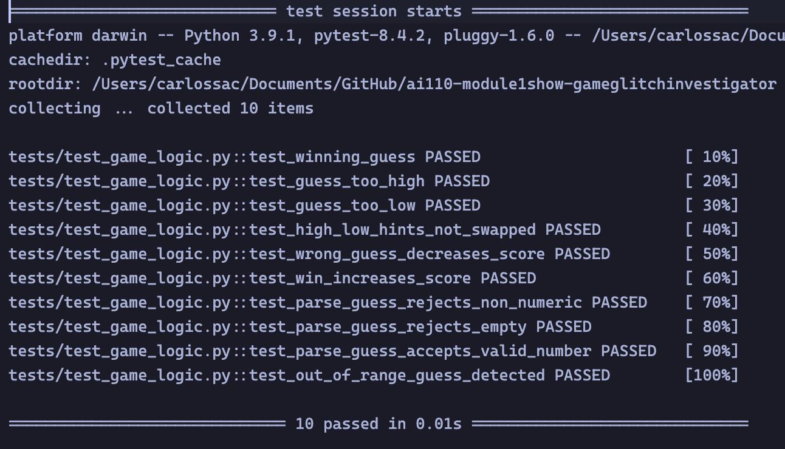

# 🎮 Game Glitch Investigator: The Impossible Guesser

## The Impossible Guesser - Game's Purpose

The Impossible Guesser is a number guessing game where the player tries to guess a secret number within a limited number of attempts. After each guess, the game gives a hint whether the guess was too high or too low. The player earns points for winning, with more points awarded for guessing correctly in fewer attempts, and loses points for wrong guesses.

## Bugs and Fixes
   - [x] When guess is too high like 99, expected hint "Go LOWER" but got "Go HIGHER."
        - #FIXED: Moved check_guess out of app.py, fixed swapped high/low hints, and removed string casting of secret in app.py using claude.
   - [x] When starting a new game, expected history and attempts to reset but previous guesses were kept
        - #Fixed: New game now clears history, resets attempts to 0, resets status to "playing", and uses difficulty-based range instead of hardcoded 1-100.
   - [x] After winning, expected to be able to start a new game but the button did not work
        - #Fixed: New game now resets status to "playing", allowing a new game after a win or loss.
   - [x] When entering a number outside 1–100, expected an error or rejection but any number was accepted
        - #Fixed: Added range validation in app.py after parse_guess; shows an error if guess is outside the difficulty range.
   - [x] After submitting the guess, expected the guess to appear in history immediately but it was not updated
        - #Fixed: Moved the debug expander to after the submit block so history reflects the current guess on the same rerun.
   - [x] On Normal difficulty, expected the same or more attempts than Easy but Normal gives 7 and Easy gives 5 (should be the other way around)
        - #Fixed: Changed Easy attempts from 6 to 10 so Easy (10) > Normal (8) > Hard (5).
   - [x] On Hard difficulty, expected a larger range than Normal to make it harder, but the range was 1-50 which is easier than Normal.
        - #Fixed: Display correct range and attempts left based on difficulty settings.
   - [x] The guess prompt always said "between 1 and 100" regardless of difficulty, expected the message to reflect the actual range
        - #Fixed: Display correct range and attempts left based on difficulty settings.
   - [x] When guessing too high on an even attempt, expected score to decrease but it increases by 5 (wrong guesses should never reward points)
        - #FIXED: Updated scoring logic to keep penalties consistent for wrong guesses.

## 🚨 The Situation

You asked an AI to build a simple "Number Guessing Game" using Streamlit.
It wrote the code, ran away, and now the game is unplayable. 

- You can't win.
- The hints lie to you.
- The secret number seems to have commitment issues.

## 🛠️ Setup

1. Install dependencies: `pip install -r requirements.txt`
2. Run the broken app: `python -m streamlit run app.py`

## 🕵️‍♂️ Your Mission

1. **Play the game.** Open the "Developer Debug Info" tab in the app to see the secret number. Try to win.
2. **Find the State Bug.** Why does the secret number change every time you click "Submit"? Ask ChatGPT: *"How do I keep a variable from resetting in Streamlit when I click a button?"*
3. **Fix the Logic.** The hints ("Higher/Lower") are wrong. Fix them.
4. **Refactor & Test.** - Move the logic into `logic_utils.py`.
   - Run `pytest` in your terminal.
   - Keep fixing until all tests pass!

## 📝 Document Your Experience

- [x] Describe the game's purpose.
- [x] Detail which bugs you found.
- [x] Explain what fixes you applied.

## 📸 Demo

### Tests

## 🚀 Stretch Features

- [ ] [If you choose to complete Challenge 4, insert a screenshot of your Enhanced Game UI here]
